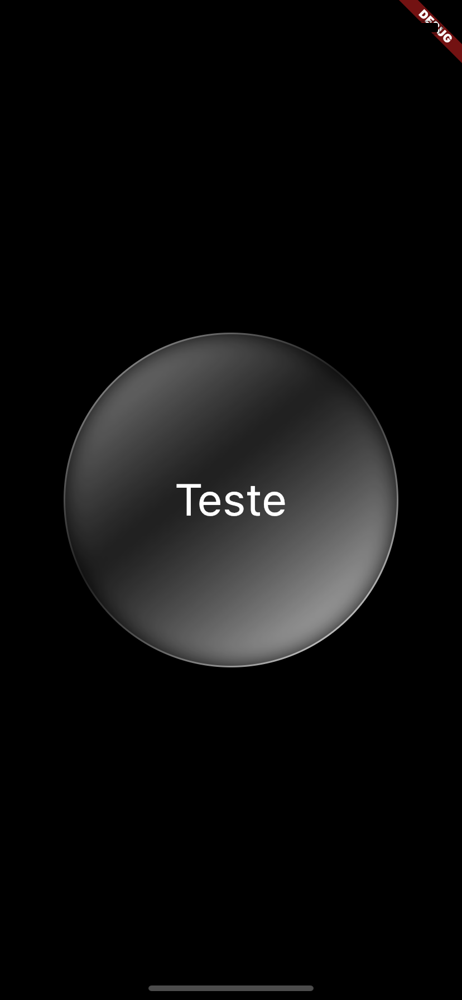
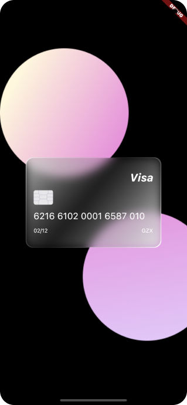
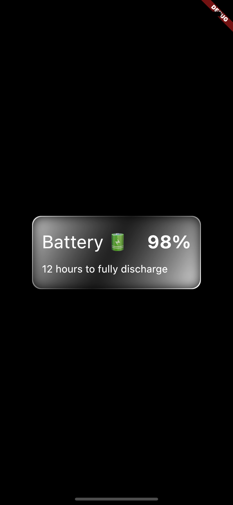

# Glass Card

Flutter plugin that provides a glass card for your applications.

## Getting Started

This plugin provides a glass card for your apps. The design pattern known as glassmorphism that uses your app's components as if it were glass. This plugin comes to facilitate the construction of apps that use this pattern.

To use this library is very simple, you just need to pass information such as height, length, edge radius, and the child of the glass card. As seen in the snippet below:

```dart
CardGlass(
  height: 300,
  width: 300,
  borderRadius: BorderRadius.all(Radius.circular(150)),
  child: Container(
    alignment: Alignment.center,
    child: Text(
      'Teste',
      style: TextStyle(fontSize: 40, color: Colors.white),
    ),
  ),
)
```


You can use create cards like:



